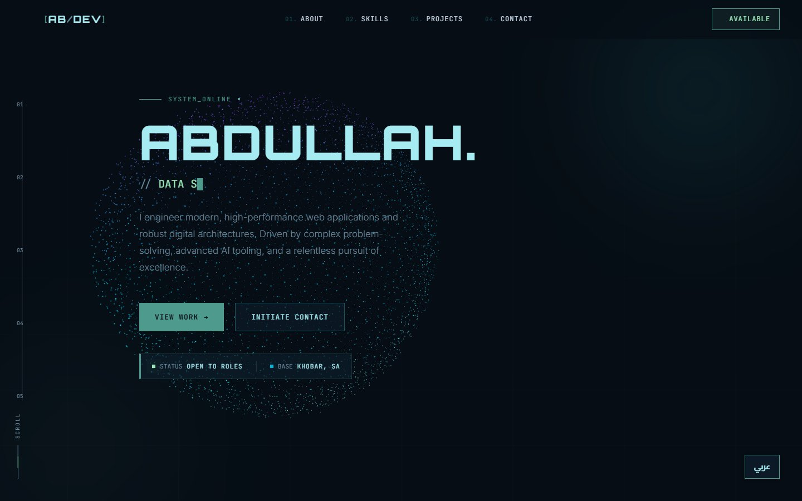
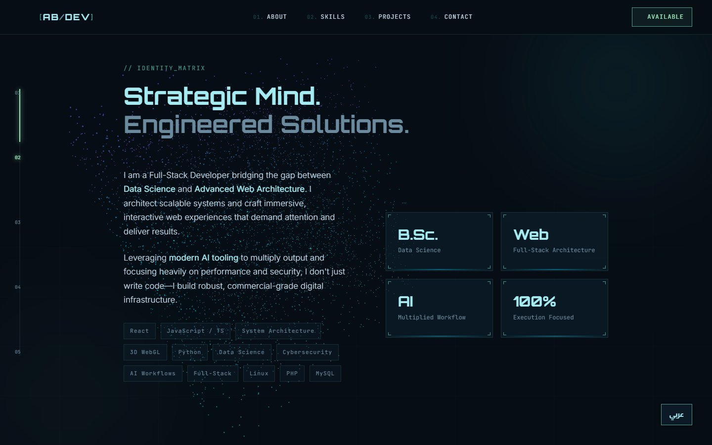
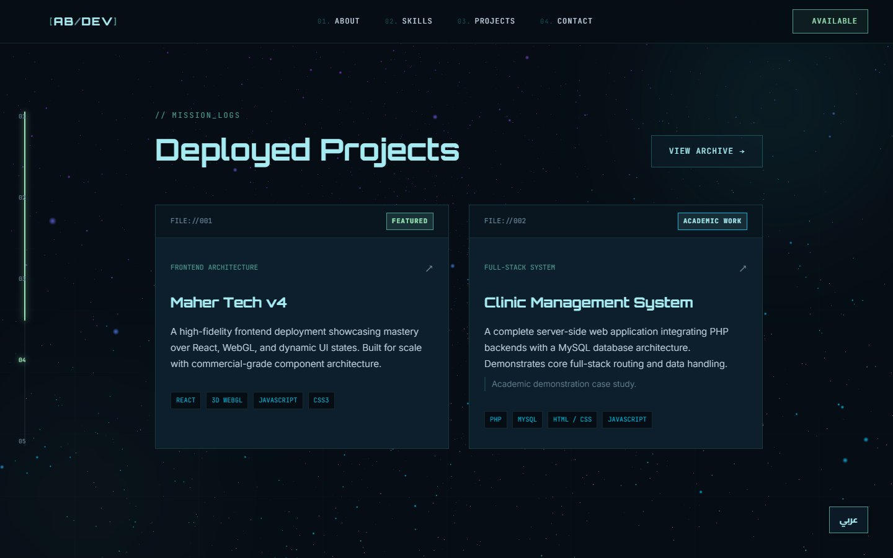
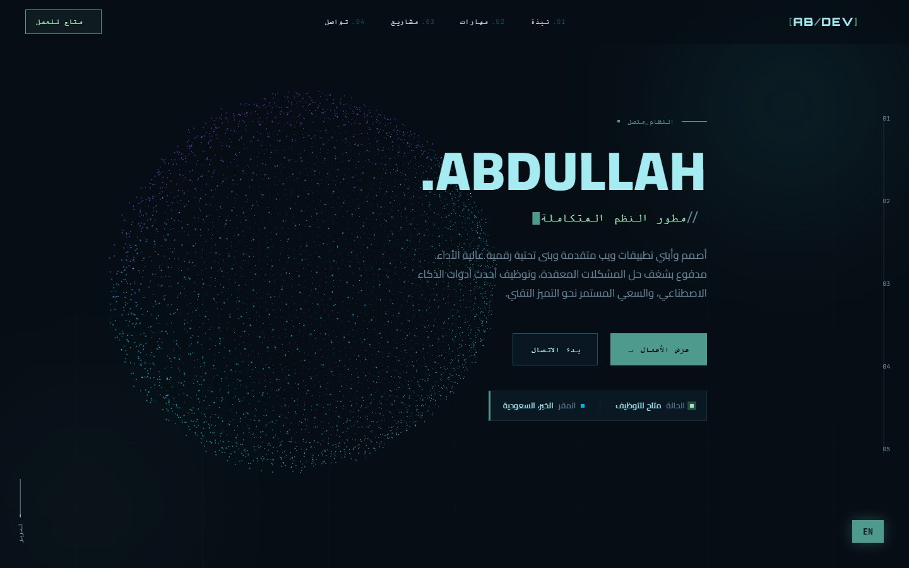
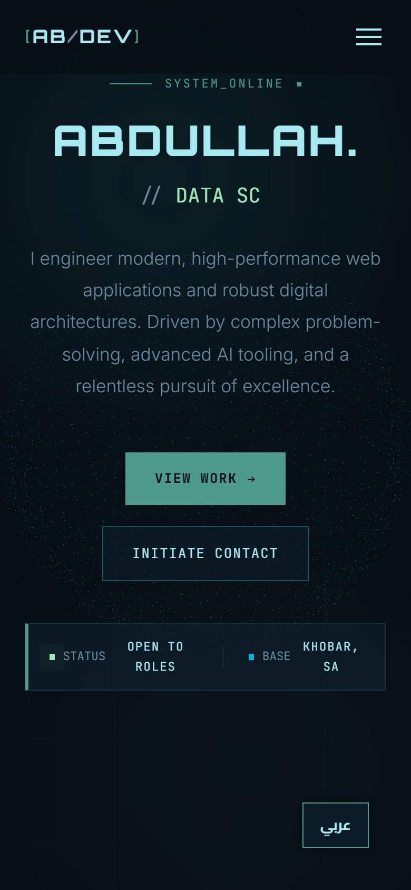

# ABDULLAH // Portfolio

My personal developer portfolio: a dark, terminal-flavoured single page where a **WebGL particle cloud reshapes itself** (sphere → cube → torus → scatter) as you scroll through the sections. Fully bilingual, English and Arabic.

**Live:** https://abdullah.pageui.workers.dev/



## Features

- **three.js particle morph system**: 4,000 shader-coloured points (teal / electric blue / purple, additive blending) that morph to a new shape per section, driven by GSAP ScrollTrigger
- **Hero** with a glitch title and a typewriter that cycles through roles
- **About** with skill chips and stat tiles; **Capabilities**; **Deployed projects** with 3D tilt cards; **Contact** with an "encrypted text" decode effect
- **English ⇄ العربية** toggle: every string comes from one translation table, and the layout flips to RTL
- Scroll-progress sidebar, scroll-reveal animations, responsive mobile menu

## Screenshots

| About | Projects |
|---|---|
|  |  |

| Arabic (RTL) | Phone |
|---|---|
|  |  |

## Tech stack

- HTML, CSS, vanilla JavaScript, with no build step
- **three.js r128** (custom `ShaderMaterial` points), **GSAP 3 + ScrollTrigger** (from CDN)
- Fonts: Orbitron, Inter, JetBrains Mono, Cairo
- Hosted on **Cloudflare Workers**

## Run locally

```bash
git clone https://github.com/abdullah2036/portfolio2.git
cd portfolio2
python -m http.server 8000     # then open http://localhost:8000
```

## Project structure

```
portfolio2/
├── index.html    sections: hero, about, services, projects, statement, contact
├── style.css     theme, layout, glitch/typewriter/tilt effects, RTL rules, responsive
└── main.js       01 translation engine (EN/AR) · 02 WebGL particle morph system
                  03 hero glitch + typewriter · 04 scroll reveal · 05 progress sidebar
                  06 project card tilt · 07 encrypted-text decode · 08 navigation
```

> My newer portfolio is a playable pixel-art world: [**pixelportfolio**](https://github.com/abdullah2036/pixelportfolio).

---

Built by **Abdullah Bokhary** · [LinkedIn](https://www.linkedin.com/in/abdullah-bokhary-840315326/) · [GitHub](https://github.com/abdullah2036)
